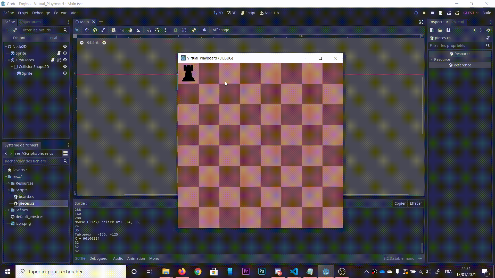

# Virtual Playboard

- Plateau de jeu intégrant un futur jeu d'échec. 

- Coder en C# sur Godot.

- Utilisation d'un RaspberryPI pourr accueilir le programme.

## DEMO

## CHANGELOG

 - Plateau de jeu.
 - Déplacement d'un pion.
 - Déplacement au centre de la case.
 - Fenêtre de jeu.