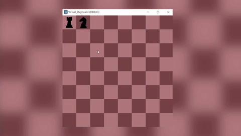

# Virtual Playboard

- Plateau de jeu intégrant un futur jeu d'échec. 

- Coder en C# sur Godot.

- Utilisation d'un RaspberryPI pourr accueilir le programme.

## DEMO

## CHANGELOG

 - Plateau de jeu.
 - Déplacement d'un pion.
 - Déplacement au centre de la case.
 - Fenêtre de jeu.

## Usefull

Pour lancer le projet il vous faut [Godot](https://godotengine.org/download) ATTENTION : Il vous faut télécharger la ``version mono``

Ainsi que ces deux modules : 
 - [OpenGL](https://microdp.com/opengl-21-gratuitement-86/)
 - [Mono](https://www.mono-project.com/download/stable/)

Pour VSCode, il est conséillée de prendre les extensions :
 - ``C#`` par "Microsoft" (9,9M Downloads).
 - ``C# Tools for Godot`` par "Ignacio Roldan Etcheverry" (9K Downloads)
